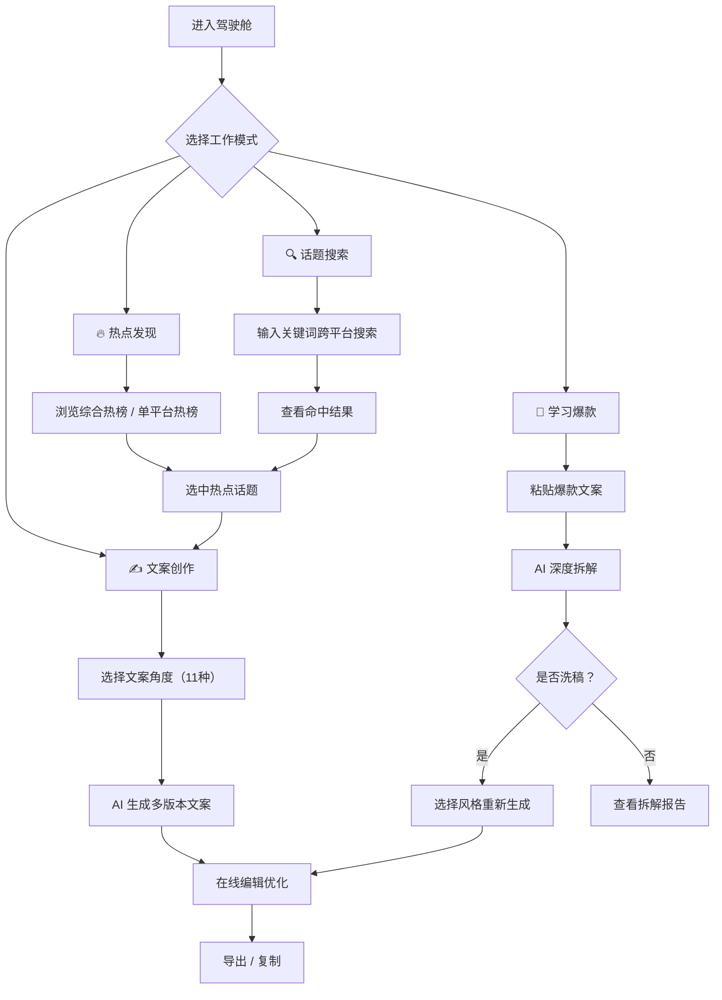

## 1. 产品概述

将 COZE Agent 从纯对话界面升级为"内容引力引擎"——一个数据驱动的爆款内容决策控制台。告别聊天框，拥抱模块化、可视化的内容创作工作流。

- **核心目标**：将 Agent 的 5 大核心功能模块（热榜聚合、话题搜索、选题与文案生成、用户画像记忆、爆款拆解）组织为可操作的交互面板，让创作者像操控驾驶舱一样创作内容
- **目标用户**：新媒体内容创作者、自媒体运营者、营销文案策划
- **设计理念**：不做"聊天机器人"，而是做"内容创作操作系统"

## 2. 核心功能

### 2.1 功能模块

1. **热榜驾驶舱（Hot Radar）**：可视化展示 40+ 平台热榜数据，支持综合 Top15 和单平台筛选
2. **话题勘探（Topic Explorer）**：跨平台话题搜索与匹配，可视化展示命中率
3. **文案工坊（Content Forge）**：11 种文案角度的多版本生成与对比
4. **创作档案（Creator Profile）**：用户画像管理，赛道/受众/风格记忆
5. **爆款拆解（Hit Analyzer）**：爆款文案深度剖析与智能洗稿

### 2.2 用户角色

| 角色 | 注册方式 | 核心权限 |
|------|---------|---------|
| 创作者 | API Token 配置 | 使用所有功能模块，管理个人画像 |

### 2.3 页面详情

| 页面名称 | 模块名称 | 功能描述 |
|---------|---------|---------|
| 热榜驾驶舱 | 综合热榜 | 五大平台合并去重 Top15，带来源标注和时间轴趋势 |
| 热榜驾驶舱 | 单平台热榜 | 切换查看各平台独立热榜，支持关键词过滤 |
| 话题勘探 | 跨平台搜索 | 输入话题关键词，在五大平台中搜索匹配热点 |
| 话题勘探 | 结果面板 | 各平台命中情况可视化展示（命中/未命中/无结果） |
| 文案工坊 | 选题面板 | 基于热榜/搜索结果的选题推荐 |
| 文案工坊 | 文案生成 | 选择 11 种文案角度，生成多版本文案并排对比 |
| 文案工坊 | 文案编辑器 | 在线编辑/微调生成的文案 |
| 创作档案 | 信息管理 | 赛道、受众、风格偏好等信息的填写与管理 |
| 爆款拆解 | 拆解面板 | 输入爆款文案，自动生成钩子分析、结构拆解、关键元素提炼 |
| 爆款拆解 | 洗稿面板 | 基于拆解结果，指定风格进行智能洗稿 |

## 3. 核心流程

## 4. 用户界面设计

### 4.1 设计风格

**美学定位："内容引力场"（Content Gravity Field）**
- 灵感来源于：太空探索 + 数据驾驶舱 + 高端杂志排版
- 整体调性：深邃、数据感、精致、有力量感

**色彩体系：**
- 主背景色：`#0B0D17`（深空蓝黑）
- 表面色：`#131724`（稍亮面板）
- 卡片色：`#1A1F2E`
- 主色调：`#F0B429`（琥珀金 - 代表热点内容的"黄金"价值）
- 辅助色：`#5B8DEF`（科技蓝 - 数据面板）
- 成功色：`#34D399`（翠绿）
- 警示色：`#F87171`（暖红）
- 强调色渐变：`linear-gradient(135deg, #F0B429, #F97316)`
- 文字色：`#E8EDF5`（主文字）, `#8892A8`（次要文字）

**字体：**
- 标题字体：`"Space Grotesk", "Noto Sans SC", sans-serif`（现代、有科技感）
- 正文字体：`"Inter", "Noto Sans SC", sans-serif`（清晰可读）
- 数据字体：`"JetBrains Mono", "Fira Code", monospace`（等宽数据）

**按钮风格：**
- 主按钮：琥珀金渐变背景，无边框，轻微圆角（8px），hover 有发光效果
- 次要按钮：透明背景 + 1px 边框，hover 时填充背景
- 操作按钮：圆角矩形，有微动效

**布局风格：**
- 左侧窄边栏（60px）用于全局导航，图标 + tooltip
- 顶部状态栏显示 Bot 连接状态和当前模式
- 主内容区采用卡片式布局，支持拖拽调整布局（未来）
- 非对称布局，打破网格常规

**动效：**
- 页面切换：平滑淡入 + 轻微上移
- 卡片进入：交错渐入（staggered fade-in）
- 数据更新：数字跳动动画
- 热点列表：横向滚动跑马灯效果
- 文案生成：打字机效果
- hover 状态：卡片轻微上浮 + 阴影加深

**图标风格：**
- 使用 Lucide 图标库
- 线条风格，1.5px 描边
- 配合琥珀金活跃态

### 4.2 页面设计概览

| 页面名称 | 模块名称 | UI 元素 |
|---------|---------|--------|
| 全局 | 导航栏 | 左侧竖排图标导航（60px宽），激活态高亮，tooltip 标签 |
| 全局 | 顶部状态栏 | Bot 状态指示灯 + 当前模式标签 + 设置入口 |
| 热榜驾驶舱 | 综合热榜 | 横向滚动卡片墙，每张卡片：排名、标题、平台来源徽章、热度指数 |
| 热榜驾驶舱 | 平台选择器 | 横向标签栏，可切换综合/微博/抖音/知乎/B站/小红书 |
| 话题勘探 | 搜索栏 | 搜索框 + 关键词拆解标签 + 搜索按钮 |
| 话题勘探 | 结果面板 | 5个平台结果卡片，每个卡片内显示命中数/标题列表 |
| 文案工坊 | 角度选择器 | 11种角度的网格选择器，每种有图标+简短描述 |
| 文案工坊 | 文案对比 | 多列卡片排布，每个卡片是一版文案，可滚动查看完整内容 |
| 创作档案 | 表单面板 | 分段式表单，硬约束和软约束分区展示 |
| 爆款拆解 | 拆解报告 | 结构化报告：钩子→结构→关键元素→可复用模型→风险提示 |
| 爆款拆解 | 洗稿面板 | 并排对比：原文 vs 洗稿后，风格选择器 |

### 4.3 响应式

- 桌面优先设计（最小 1280px）
- 平板适配：侧边栏可折叠为汉堡菜单
- 移动端：单列布局，底部导航栏替代左侧导航
- 卡片在小屏下自动切换为垂直排列

### 4.4 差异化设计亮点

**1. 热榜"引力波"效果**
- 热点卡片根据热度指数有不同的大小和"引力"强度
- 热度高的卡片更大、更亮、位置更靠中心
- 视觉上像行星围绕恒星运转

**2. 文案生成"交响乐"模式**
- 选择多个文案角度后，同时生成并排展示
- 像交响乐的不同声部，用户可以直观对比
- 每个版本用不同颜色的标签标识类型

**3. "创作能量"仪表**
- 右上角圆形仪表盘，显示当日已生成文案数、已拆解数
- 用动画弧线展示"创作能量"的消耗与补充
- 给创作者一种游戏化的进度感

**4. 话题热力地图**
- 搜索结果以热力图方式展示
- 每个平台是一个"大陆"，命中热点是"城市"
- 城市大小代表热度高低