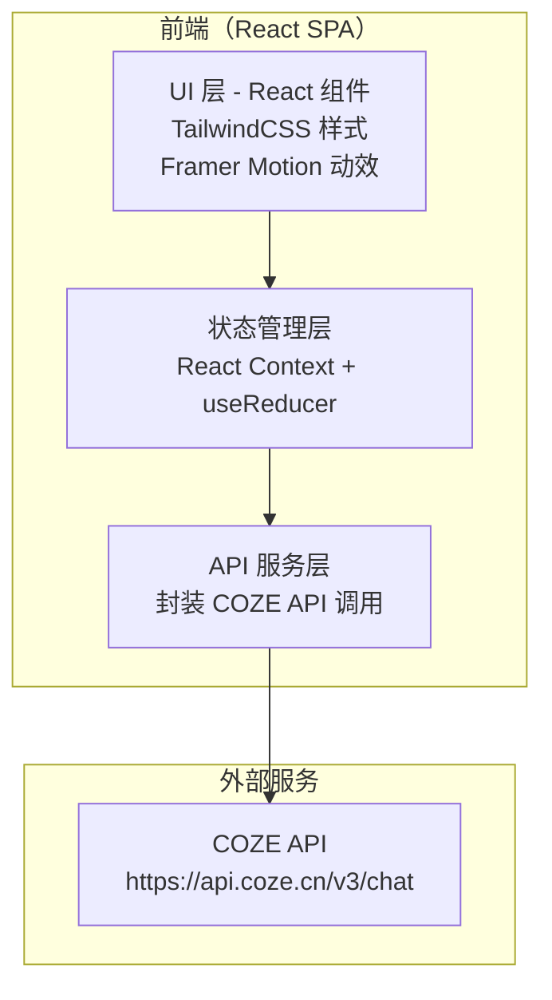

## 1. 架构设计



## 2. 技术说明

- **前端框架**：React@18 + Vite
- **样式方案**：TailwindCSS@3 + CSS Variables 自定义主题
- **动效库**：Framer Motion（页面过渡、卡片入场、打字机效果）
- **图标库**：Lucide React
- **字体**：Google Fonts - Space Grotesk（标题）, Inter（正文）, JetBrains Mono（数据）
- **构建工具**：Vite@5
- **包管理**：npm
- **部署**：纯静态站点，可部署到 Vercel / Netlify / GitHub Pages

## 3. 路由定义

| 路由 | 页面 | 说明 |
|------|------|------|
| `/` | 热榜驾驶舱 | 首页，综合热榜展示 |
| `/explore` | 话题勘探 | 跨平台话题搜索 |
| `/forge` | 文案工坊 | 选题与文案生成 |
| `/profile` | 创作档案 | 个人信息管理 |
| `/analyze` | 爆款拆解 | 文案拆解与洗稿 |

## 4. API 定义

### 4.1 COZE API 调用封装

所有 API 调用通过统一的 `CozeService` 层转发到 COZE API。

**基础配置：**
```typescript
interface CozeConfig {
  botId: string;
  token: string;
  baseUrl: string; // https://api.coze.cn
}
```

**通用请求体：**
```typescript
interface ChatRequest {
  bot_id: string;
  user_id: string;
  stream: boolean;
  auto_save_history: boolean;
  additional_messages: Array<{
    role: 'user' | 'assistant';
    content: string;
    content_type: 'text';
  }>;
}
```

**通用响应体：**
```typescript
interface ChatResponse {
  id: string;
  conversation_id: string;
  messages: Array<{
    role: string;
    content: string;
    content_type: string;
  }>;
  // ... other fields
}
```

### 4.2 前端 API 服务类型定义

```typescript
// 热榜数据
interface HotListItem {
  rank: number;
  title: string;
  platform: 'weibo' | 'douyin' | 'zhihu' | 'bilibili' | 'xiaohongshu';
  heatScore: number;
  url?: string;
}

// 话题搜索结果
interface TopicSearchResult {
  platform: string;
  matched: boolean;
  count: number;
  items: Array<{
    title: string;
    heat: number;
  }>;
}

// 文案生成请求
interface CopywriteRequest {
  topic: string;
  angles: string[]; // 选择的文案角度
  userProfile?: UserProfile;
}

// 文案拆解结果
interface CopywriteAnalysis {
  hook: string;
  structure: string[];
  keyElements: string[];
  reusableModel: string;
  riskWarnings: string[];
}

// 用户画像
interface UserProfile {
 赛道?: string;
  目标受众?: string;
  昵称?: string;
  文风偏好?: string;
  内容形式?: string;
}
```

## 5. 前端状态管理

### 5.1 全局状态

```typescript
interface AppState {
  // COZE 配置
  config: CozeConfig | null;
  isConnected: boolean;
  
  // 热榜数据
  hotList: HotListItem[];
  selectedPlatform: 'all' | string;
  isLoadingHotList: boolean;
  
  // 话题搜索
  searchQuery: string;
  searchResults: TopicSearchResult[];
  isSearching: boolean;
  
  // 文案生成
  selectedTopic: string;
  selectedAngles: string[];
  generatedCopies: Array<{ angle: string; content: string }>;
  isGenerating: boolean;
  
  // 用户画像
  userProfile: UserProfile;
  
  // 爆款拆解
  analysisResult: CopywriteAnalysis | null;
  rewriteResult: string | null;
  
  // 创作统计
  creationStats: {
    todayCopies: number;
    todayAnalysis: number;
  };
}
```

### 5.2 数据流

```
用户操作 → Dispatch Action → Reducer 更新 State → 触发 API 调用 → 
更新 State → React 重新渲染 → UI 反馈
```

## 6. 组件树设计

```
App
├── Sidebar (导航侧边栏)
│   ├── NavItem (热榜驾驶舱)
│   ├── NavItem (话题勘探)
│   ├── NavItem (文案工坊)
│   ├── NavItem (创作档案)
│   └── NavItem (爆款拆解)
├── TopBar (顶部状态栏)
│   ├── ConnectionStatus (连接状态指示灯)
│   ├── CurrentMode (当前模式标签)
│   └── CreationEnergy (创作能量仪表)
└── MainContent (主内容区)
    ├── HotRadar (热榜驾驶舱)
    │   ├── PlatformSelector (平台选择器)
    │   └── HotCardWall (热榜卡片墙)
    │       └── HotCard (单条热榜卡片)
    ├── TopicExplorer (话题勘探)
    │   ├── SearchBar (搜索栏)
    │   └── ResultGrid (结果网格)
    │       └── PlatformResultCard (单平台结果)
    ├── ContentForge (文案工坊)
    │   ├── AngleSelector (角度选择器)
    │   ├── TopicPanel (选题面板)
    │   └── CopyCompare (文案对比)
    │       └── CopyCard (单版文案卡片)
    ├── CreatorProfile (创作档案)
    │   ├── CoreInfoForm (核心信息表单)
    │   └── ExtendedInfoForm (扩展信息表单)
    └── HitAnalyzer (爆款拆解)
        ├── InputPanel (文案输入)
        ├── AnalysisReport (拆解报告)
        └── RewritePanel (洗稿面板)
```

## 7. 目录结构

```
src/
├── App.jsx                    # 根组件 + 路由
├── main.jsx                   # 入口文件
├── index.css                  # 全局样式 + 主题变量
├── components/
│   ├── layout/
│   │   ├── Sidebar.jsx        # 导航侧边栏
│   │   ├── TopBar.jsx         # 顶部状态栏
│   │   └── MainContent.jsx    # 主内容容器
│   ├── hot-radar/
│   │   ├── HotRadar.jsx       # 热榜驾驶舱
│   │   ├── PlatformSelector.jsx
│   │   ├── HotCardWall.jsx
│   │   └── HotCard.jsx
│   ├── topic-explorer/
│   │   ├── TopicExplorer.jsx
│   │   ├── SearchBar.jsx
│   │   ├── ResultGrid.jsx
│   │   └── PlatformResultCard.jsx
│   ├── content-forge/
│   │   ├── ContentForge.jsx
│   │   ├── AngleSelector.jsx
│   │   ├── TopicPanel.jsx
│   │   ├── CopyCompare.jsx
│   │   └── CopyCard.jsx
│   ├── creator-profile/
│   │   ├── CreatorProfile.jsx
│   │   ├── CoreInfoForm.jsx
│   │   └── ExtendedInfoForm.jsx
│   ├── hit-analyzer/
│   │   ├── HitAnalyzer.jsx
│   │   ├── InputPanel.jsx
│   │   ├── AnalysisReport.jsx
│   │   └── RewritePanel.jsx
│   └── ui/
│       ├── ConnectionStatus.jsx
│       ├── CreationEnergy.jsx
│       ├── LoadingSpinner.jsx
│       └── AnimatedCounter.jsx
├── services/
│   └── cozeApi.js             # COZE API 封装
├── state/
│   ├── AppContext.jsx         # 全局上下文
│   ├── appReducer.js          # 状态控制
│   └── types.js               # 类型/常量定义
└── hooks/
    ├── useCozeApi.js          # API 调用 hook
    └── useAnimation.js        # 动画控制 hook
```

## 8. 性能与安全

- **敏感信息安全**：Token 仅存储在内存中（React State），不写入 LocalStorage
- **请求防抖**：搜索输入 300ms 防抖，避免频繁 API 调用
- **错误降级**：API 失败时显示优雅的错误状态，不暴露原始错误详情
- **加载状态**：每个数据获取操作都有独立的 loading/skeleton 状态
- **空状态设计**：无数据时展示引导性空状态而非空白页面